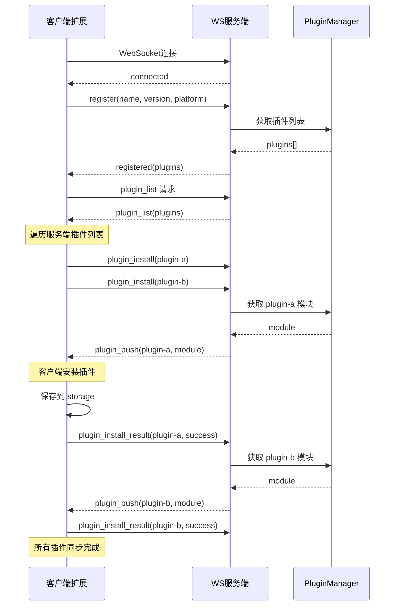
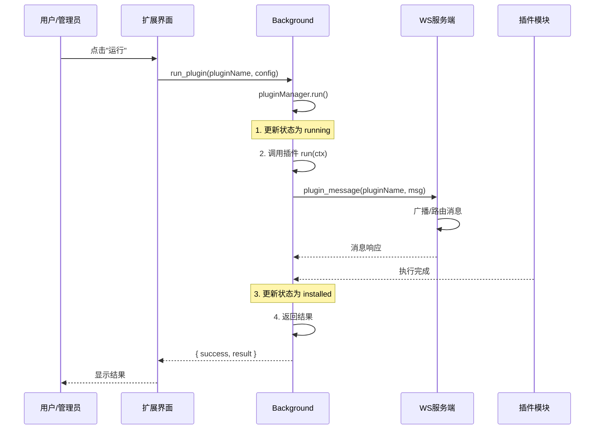

# RemoteF 流程文档

## 目录

- [连接流程](#连接流程)
- [插件安装流程](#插件安装流程)
- [插件运行流程](#插件运行流程)
- [消息通信流程](#消息通信流程)
- [时序图](#时序图)

---

## 连接流程

### 客户端连接

```
┌─────────┐                              ┌─────────┐
│  客户端  │                              │  服务端  │
└────┬────┘                              └────┬────┘
     │                                        │
     │  1. 用户点击"连接"或启用"自动连接"        │
     │────────────────────────────────────────>│
     │                                        │
     │  2. WebSocket 连接建立                   │
     │<────────────────────────────────────────│
     │                                        │
     │  3. 服务端发送 connected                 │
     │<────────────────────────────────────────│
     │                                        │
     │  4. 客户端发送 register                   │
     │────────────────────────────────────────>│
     │   {                                      │
     │     type: "register",                   │
     │     payload: { name, version, platform, │
     │                  extensions }            │
     │   }                                      │
     │────────────────────────────────────────>│
     │                                        │
     │  5. 服务端发送 registered                 │
     │<────────────────────────────────────────│
     │   { type: "registered",                 │
     │     payload: { success: true,           │
     │                plugins: [...] } }       │
     │                                        │
     │  6. 客户端请求 plugin_list               │
     │────────────────────────────────────────>│
     │   { type: "plugin_list" }               │
     │────────────────────────────────────────>│
     │                                        │
     │  7. 服务端发送 plugin_list               │
     │<────────────────────────────────────────│
     │   { type: "plugin_list",                │
     │     payload: { plugins: [...] } }       │
     │                                        │
     ▼                                        ▼
```

### 自动重连流程

```
客户端                      服务端
   │                          │
   │ ── WebSocket 连接 ──────> │ 连接正常
   │                          │
   │                    [服务端重启]
   │                          │
   │ <── 连接关闭 ──────────── │
   │   code: 1006             │
   │                          │
   │ 3秒后                     │
   │ ── 重连 ─────────────────> │
   │                          │
```

---

## 插件安装流程

### 方式一：客户端主动安装

```
┌─────────┐                              ┌─────────┐
│  客户端  │                              │  服务端  │
└────┬────┘                              └────┬────┘
     │                                        │
     │  1. 用户点击"安装"插件                  │
     │────────────────────────────────────────>│
     │   { type: "plugin_install",             │
     │     payload: { pluginName: "xxx" } }   │
     │────────────────────────────────────────>│
     │                                        │
     │  2. 服务端查找插件                      │
     │                                        │
     │  3. 服务端发送 plugin_push              │
     │<────────────────────────────────────────│
     │   { type: "plugin_push",                │
     │     payload: { pluginName, module } }  │
     │                                        │
     │  4. 客户端安装插件                      │
     │  5. 发送 plugin_install_result          │
     │────────────────────────────────────────>│
     │   { type: "plugin_install_result",     │
     │     payload: { pluginName, success } } │
     │                                        │
     ▼                                        ▼
```

### 方式二：服务端推送安装

```
┌─────────┐                              ┌─────────┐
│  客户端  │                              │  服务端  │
└────┬────┘                              └────┬────┘
     │                                        │
     │                         [管理员在 /admin 界面选择客户端安装插件]
     │                                        │
     │  1. 服务端发送 plugin_push              │
     │<────────────────────────────────────────│
     │   { type: "plugin_push",                │
     │     payload: { pluginName, module } }  │
     │                                        │
     │  2. 客户端安装插件                      │
     │  3. 发送 plugin_install_result         │
     │────────────────────────────────────────>│
     │   { type: "plugin_install_result",     │
     │     payload: { pluginName, success } } │
     │                                        │
     ▼                                        ▼
```

---

## 插件运行流程

### 客户端触发

```
┌─────────┐                              ┌─────────┐
│  客户端  │                              │  服务端  │
└────┬────┘                              └────┬────┘
     │                                        │
     │  1. 用户点击"运行"或定时触发             │
     │────────────────────────────────────────>│
     │   { type: "plugin_run_request",         │
     │     payload: { pluginName, config } }   │
     │────────────────────────────────────────>│
     │                                        │
     │  2. 服务端转发或处理                    │
     │  3. 返回 plugin_run_result             │
     │<────────────────────────────────────────│
     │   { type: "plugin_run_result",          │
     │     payload: { pluginName, success,    │
     │                result, error } }        │
     │                                        │
     ▼                                        ▼
```

### 服务端触发

```
┌─────────┐                              ┌─────────┐
│  客户端  │                              │  服务端  │
└────┬────┘                              └────┬────┘
     │                                        │
     │                         [管理员在 /admin 触发]
     │                                        │
     │  1. 服务端发送 plugin_run               │
     │<────────────────────────────────────────│
     │   { type: "plugin_run",                │
     │     payload: { pluginName, config } }  │
     │                                        │
     │  2. 客户端执行插件                      │
     │  3. 发送 plugin_run_result             │
     │────────────────────────────────────────>│
     │   { type: "plugin_run_result",          │
     │     payload: { pluginName, success,    │
     │                result, error } }        │
     │                                        │
     ▼                                        ▼
```

---

## 消息通信流程

### 消息格式

```javascript
// 所有消息统一格式
{
  type: string,      // 消息类型
  payload: any,      // 消息数据
  timestamp: number // 时间戳（服务端添加）
}
```

### 消息类型总览

| 类型 | 方向 | 说明 |
|------|------|------|
| `connected` | S→C | 连接成功 |
| `registered` | S→C | 注册成功 |
| `plugin_list` | 双向 | 插件列表请求/响应 |
| `plugin_install` | C→S | 安装请求 |
| `plugin_push` | S→C | 插件推送 |
| `plugin_install_result` | C→S | 安装结果 |
| `plugin_run` | S→C | 运行触发 |
| `plugin_run_request` | C→S | 运行请求 |
| `plugin_run_result` | 双向 | 运行结果 |
| `plugin_message` | 双向 | 插件间通信 |

---

## 时序图

### 完整连接与插件同步时序



### 插件运行完整时序



---

## 状态流转

### 客户端连接状态

```
              ┌──────────────┐
              │   disconnected │
              └──────┬───────┘
                     │ connect()
                     ▼
              ┌──────────────┐
              │   connecting  │◄────┐
              └──────┬───────┘      │
                     │ connected    │  reconnect()
                     ▼              │
              ┌──────────────┐      │
              │   connected   │─────┘
              └──────┬───────┘
                     │ disconnect() / 断开
                     ▼
              ┌──────────────┐
              │ disconnected │
              └──────────────┘
```

### 插件运行状态

```
    ┌──────────────┐
    │   uninstalled │
    └──────┬───────┘
           │ install()
           ▼
    ┌──────────────┐
    │   installed   │◄────┐
    └──────┬───────┘      │
           │ run()         │ run() (重新运行)
           ▼               │
    ┌──────────────┐       │
    │   running     │──────┘
    └──────┬───────┘
           │ complete / stop()
           ▼
    ┌──────────────┐
    │   installed   │
    └──────┬───────┘
           │ uninstall()
           ▼
    ┌──────────────┐
    │ uninstalled  │
    └──────────────┘
```

---

## 错误处理

### 连接错误

| 错误类型 | 处理方式 |
|----------|----------|
| 连接超时 | 3秒后重试，最多重试3次 |
| 连接拒绝 | 提示检查服务端地址 |
| 网络断开 | 自动重连 |

### 插件错误

| 错误类型 | 处理方式 |
|----------|----------|
| 安装失败 | 记录错误，通知用户 |
| 运行超时 | 30秒超时，强制停止 |
| 运行异常 | 捕获错误，返回错误信息 |
