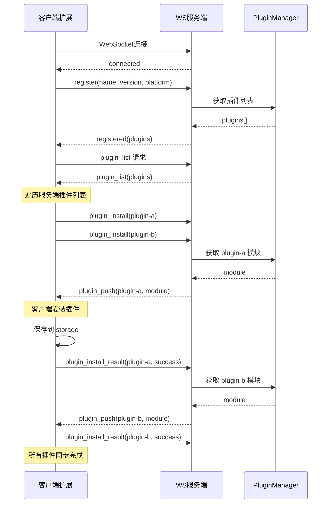
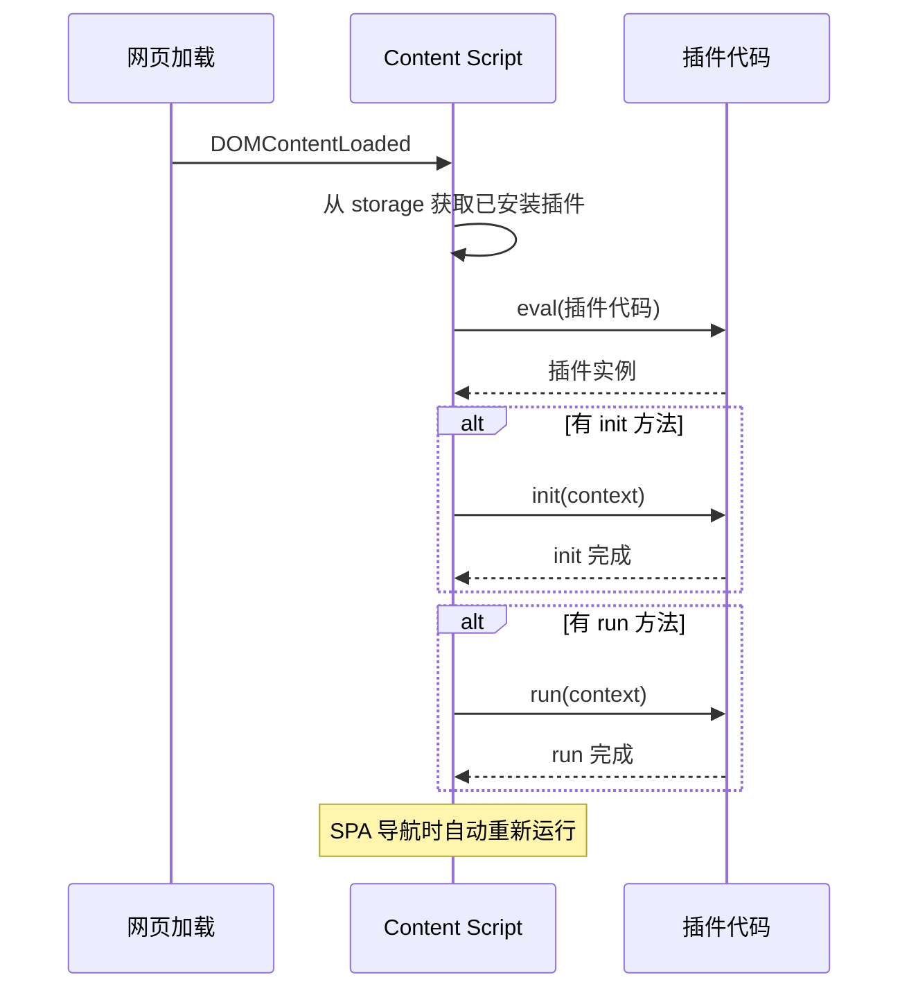

# RemoteF 流程文档

## 目录

- [连接流程](#连接流程)
- [插件安装流程](#插件安装流程)
- [插件运行流程](#插件运行流程)
- [消息通信流程](#消息通信流程)
- [时序图](#时序图)

---

## 连接流程

### 客户端连接

```
┌─────────┐                              ┌─────────┐
│  客户端  │                              │  服务端  │
└────┬────┘                              └────┬────┘
     │                                        │
     │  1. 用户点击"连接"或启用"自动连接"        │
     │────────────────────────────────────────>
     │                                        │
     │  2. WebSocket 连接建立                   │
     │<────────────────────────────────────────
     │                                        │
     │  3. 服务端发送 connected                 │
     │<────────────────────────────────────────
     │                                        │
     │  4. 客户端发送 register                   │
     │────────────────────────────────────────>
     │   {                                      │
     │     type: "register",                   │
     │     payload: { name, version, platform, │
     │                  extensions }            │
     │   }                                      │
     │────────────────────────────────────────>
     │                                        │
     │  5. 服务端发送 registered                 │
     │<────────────────────────────────────────
     │   { type: "registered",                 │
     │     payload: { success: true,           │
     │                plugins: [...] } }       │
     │                                        │
     │  6. 客户端请求 plugin_list               │
     │────────────────────────────────────────>
     │   { type: "plugin_list" }               │
     │────────────────────────────────────────>
     │                                        │
     │  7. 服务端发送 plugin_list               │
     │<────────────────────────────────────────
     │   { type: "plugin_list",                │
     │     payload: { plugins: [...] } }       │
     │                                        │
     ▼                                        ▼
```

### 自动重连流程

```
客户端                      服务端
   │                          │
   │ ── WebSocket 连接 ──────> │ 连接正常
   │                          │
   │                    [服务端重启]
   │                          │
   │ <── 连接关闭 ──────────── │
   │   code: 1006             │
   │                          │
   │ 3秒后                     │
   │ ── 重连 ─────────────────> │
   │                          │
```

---

## 插件安装流程

### 方式一：客户端主动安装

```
┌─────────┐                              ┌─────────┐
│  客户端  │                              │  服务端  │
└────┬────┘                              └────┬────┘
     │                                        │
     │  1. 用户点击"安装"插件                  │
     │────────────────────────────────────────>
     │   { type: "plugin_install",             │
     │     payload: { pluginName: "xxx" } }   │
     │────────────────────────────────────────>
     │                                        │
     │  2. 服务端查找插件                      │
     │                                        │
     │  3. 服务端发送 plugin_push              │
     │<────────────────────────────────────────
     │   { type: "plugin_push",                │
     │     payload: { pluginName, module } }  │
     │                                        │
     │  4. 客户端安装插件到 storage            │
     │  5. 发送 plugin_install_result          │
     │────────────────────────────────────────>
     │   { type: "plugin_install_result",     │
     │     payload: { pluginName, success } } │
     │                                        │
     ▼                                        ▼
```

### 方式二：服务端推送安装

```
┌─────────┐                              ┌─────────┐
│  客户端  │                              │  服务端  │
└────┬────┘                              └────┬────┘
     │                                        │
     │                         [管理员在 /admin 界面选择客户端安装插件]
     │                                        │
     │  1. 服务端发送 plugin_push              │
     │<────────────────────────────────────────
     │   { type: "plugin_push",                │
     │     payload: { pluginName, module } }  │
     │                                        │
     │  2. 客户端安装插件到 storage            │
     │  3. 发送 plugin_install_result         │
     │────────────────────────────────────────>
     │   { type: "plugin_install_result",     │
     │     payload: { pluginName, success } } │
     │                                        │
     ▼                                        ▼
```

---

## 插件运行流程

### 自动运行（默认）

客户端插件在页面加载时**自动运行**，无需手动触发：

```
┌─────────┐     ┌──────────────┐     ┌─────────┐
│ 页面加载 │────>│ Content Script │────>│ 插件运行 │
└─────────┘     └──────────────┘     └─────────┘
                        │
                        ▼
               1. 从 storage 读取已安装插件
               2. 执行 init()（如果有）
               3. 执行 run()（如果有）
               4. SPA 导航时自动重新运行
```

### 手动重运行

可以通过 background 发送 `plugin_rerun` 消息手动触发插件重新运行：

```
┌─────────┐                              ┌─────────┐
│ Background│                            │ Content  │
└────┬────┘                              └────┬────┘
     │  plugin_rerun                         │
     │───────────────────────────────────────>
     │                                        │
     │<───────────────────────────────────────
     │         (插件重新运行)
```

---

## 消息通信流程

### 消息格式

```javascript
// 所有消息统一格式
{
  type: string,      // 消息类型
  payload: any,      // 消息数据
  timestamp: number  // 时间戳（服务端添加）
}
```

### 消息类型总览

| 类型 | 方向 | 说明 |
|------|------|------|
| `connected` | S→C | 连接成功 |
| `registered` | S→C | 注册成功 |
| `plugin_list` | 双向 | 插件列表请求/响应 |
| `plugin_install` | C→S | 安装请求 |
| `plugin_push` | S→C | 插件推送 |
| `plugin_install_result` | C→S | 安装结果 |
| `plugin_message` | 双向 | 插件间通信 |
| `plugin_unload` | B→C | 卸载插件 |
| `plugin_rerun` | B→C | 重运行插件 |

---

## 时序图

### 完整连接与插件同步时序



### 插件自动运行时序



---

## 状态流转

### 客户端连接状态

```
              ┌──────────────┐
              │   disconnected │
              └──────┬───────┘
                     │ connect()
                     ▼
              ┌──────────────┐
              │   connecting  │◄────┐
              └──────┬───────┘      │
                     │ connected    │  reconnect()
                     ▼              │
              ┌──────────────┐      │
              │   connected   │─────┘
              └──────┬───────┘
                     │ disconnect() / 断开
                     ▼
              ┌──────────────┐
              │ disconnected │
              └──────────────┘
```

### 插件状态

```
    ┌──────────────┐
    │   uninstalled │
    └──────┬───────┘
           │ install()
           ▼
    ┌──────────────┐
    │   installed   │
    └──────┬───────┘
           │ 页面加载时
           ▼
    ┌──────────────┐
    │   running     │──> 完成后回到 installed
    └──────────────┘
           │ uninstall()
           ▼
    ┌──────────────┐
    │ uninstalled  │
    └──────────────┘
```

---

## 错误处理

### 连接错误

| 错误类型 | 处理方式 |
|----------|----------|
| 连接超时 | 3秒后重试，最多重试3次 |
| 连接拒绝 | 提示检查服务端地址 |
| 网络断开 | 自动重连 |

### 插件错误

| 错误类型 | 处理方式 |
|----------|----------|
| 安装失败 | 记录错误，通知用户 |
| 运行异常 | 捕获错误，记录日志 |
